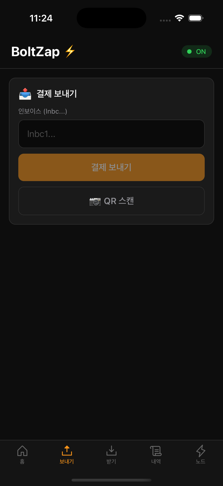
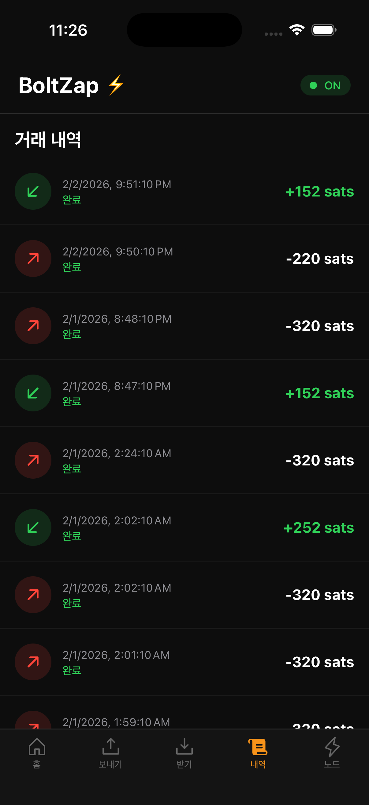

# BoltZap ⚡️

**BoltZap**은 비수탁형(Non-Custodial) 비트코인 라이트닝 네트워크 지갑입니다.
사용자가 자신의 자산에 대한 완전한 통제권을 가지며, 라이트닝 네트워크를 통해 즉각적이고 저렴한 수수료로 비트코인을 전송할 수 있습니다.

> **참고:** 이 프로젝트는 **Breez SDK**를 사용하여 라이트닝 노드 기능을 앱 내에 내장하고 있습니다. 따라서 별도의 서버(`BoltZap-Server`) 없이 앱 단독으로 노드 실행 및 결제가 가능합니다.

---

## 📱 앱 미리보기 (Software Preview)

|                                  홈 화면                                   |                                  받기 화면                                   |
| :------------------------------------------------------------------------: | :--------------------------------------------------------------------------: |
|      |      |
|                              **보내기 화면**                               |                                **거래 내역**                                 |
|  |  |
|                               **노드 상태**                                |
|    |

---

## 🚀 주요 기능 (Key Features)

- **비수탁형 지갑 (Non-Custodial):** 사용자의 개인 키는 기기에 암호화되어 안전하게 저장되며, 서버에 전송되지 않습니다.
- **라이트닝 네트워크 지원:** **Breez SDK**를 기반으로 하여 즉시 결제가 가능하며 수수료가 매우 저렴합니다.
- **온체인(On-Chain) 지원:** 일반적인 비트코인 온체인 거래도 지원하여 유동성을 쉽게 관리할 수 있습니다.
- **QR 코드 스캔:** QR 코드를 스캔하여 간편하게 송금할 수 있습니다.
- **백업 및 복구:** 표준 BIP39 니모닉 단어를 통해 지갑을 언제든지 복구할 수 있습니다.
- **강력한 보안:** 안전한 저장소(Keychain)를 활용하여 자산을 보호합니다.

---

## 📂 프로젝트 구조 (Project Structure)

이 저장소는 앱과 서버로 구성되어 있습니다.

- **`BoltZap-App/`**: 핵심 모바일 애플리케이션 (React Native). **Breez SDK**가 내장되어 있어 독립적으로 작동합니다.
- **`BoltZap-Server/`**: (현재 미사용) 초기 개발 단계의 백엔드 서비스입니다. 현재는 Breez SDK가 이 역할을 대신하므로 앱 구동에 필요하지 않습니다.

---

## 🛠 기술 스택 (Tech Stack)

- **Frontend (App):** React Native, TypeScript, Breez SDK Liquid (LSP)
- **Backend (Optional):** Node.js (Not required for main features)
- **State Management:** Zustand
- **Persistence:** MMKV, React Native Keychain

---

## 🏁 시작하기 (Getting Started)

### 1. BoltZap App 실행

**필수 요구사항:**

- Node.js (v18 이상)
- Yarn
- Android Studio (Android 개발 환경) / Xcode (iOS 개발 환경)

**설치 및 실행:**

```bash
# 앱 폴더로 이동
cd BoltZap-App

# 의존성 설치
yarn install

# Android 실행
yarn android

# iOS 실행 (macOS)
cd ios && pod install && cd ..
yarn ios
```

### 2. 환경 변수 설정 (.env)

`BoltZap-App` 루트에 `.env` 파일을 생성하고 필요한 API 키를 설정해야 합니다.

```env
BREEZ_API_KEY=your_breez_api_key
```

---

## 📜 라이선스 (License)

MIT License
